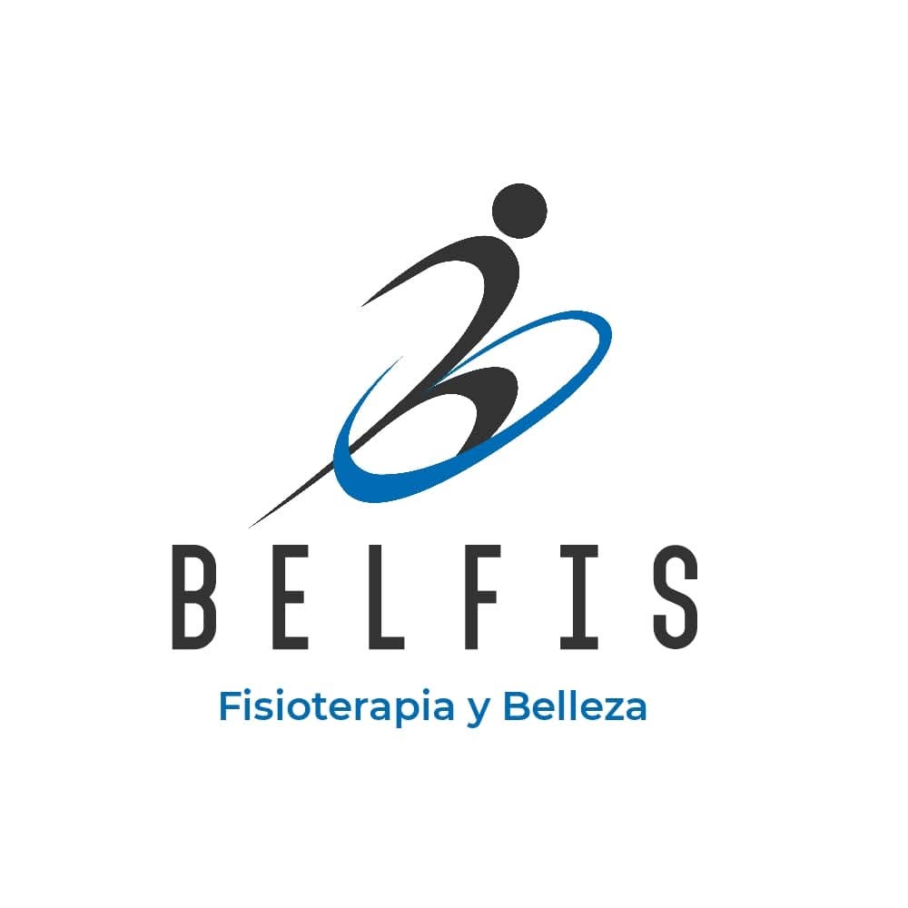

# BELFIS - Clínica de Fisioterapia Profesional

<p align="center">
  
</p>

<p align="center">
  <strong>Tu clínica de confianza para fisioterapia y rehabilitación profesional</strong>
</p>

<p align="center">
  <a href="#-descripción">Descripción</a> •
  <a href="#-características">Características</a> •
  <a href="#-instalación-y-uso">Instalación</a> •
  <a href="#-tecnologías-utilizadas">Tecnologías</a> •
  <a href="#-contacto">Contacto</a>
</p>

---

## 📋 Descripción

**BELFIS** es una clínica especializada en fisioterapia y rehabilitación ubicada en Santa Cruz, Bolivia. Este repositorio contiene el código fuente del sitio web oficial de la clínica, diseñado para ofrecer información sobre servicios, ubicación y facilitar el contacto con los pacientes.

### 🎯 Objetivos del Proyecto

- Proporcionar información clara sobre los servicios de fisioterapia
- Facilitar el contacto y agendamiento de citas
- Mostrar la ubicación y horarios de atención
- Ofrecer una experiencia de usuario moderna y responsiva

## 🚀 Demo en Vivo

🌐 **[Ver Sitio Web](https://tu-usuario.github.io/belfis-website)**

> *Reemplaza el enlace anterior con la URL de tu GitHub Pages*

---

- **Diseño Responsivo**: Adaptable a dispositivos móviles, tablets y escritorio
- **Animaciones Modernas**: Efectos visuales suaves y profesionales
- **Formulario de Contacto**: Integración con FormSubmit para recepción de mensajes
- **Menú Hamburguesa**: Navegación móvil intuitiva
- **Mapa Interactivo**: Google Maps integrado para ubicación
- **Botón WhatsApp Flotante**: Acceso rápido a contacto directo
- **Redes Sociales**: Enlaces a Facebook, Instagram y WhatsApp
- **Optimización SEO**: Meta tags y estructura semántica

## 🛠️ Tecnologías Utilizadas

<table>
  <tr>
    <td align="center" width="96">
      
      <br>HTML5
    </td>
    <td align="center" width="96">
      
      <br>CSS3
    </td>
    <td align="center" width="96">
      
      <br>JavaScript
    </td>
  </tr>
</table>

### Librerías y Servicios

- **[Font Awesome 6.0.0](https://fontawesome.com/)**: Iconografía profesional
- **[Google Maps API](https://developers.google.com/maps)**: Integración de mapas
- **[FormSubmit](https://formsubmit.co/)**: Servicio de envío de formularios

---

## 📁 Estructura del Proyecto

```
belfis-website/
│
├── index.html              # Página principal
├── styles.css              # Estilos CSS
├── script.js               # JavaScript funcional
├── README.md               # Este archivo
│
└── images/                 # Carpeta de imágenes
    ├── logo-belfis.png
    ├── fisioterapia-hero.jpg
    ├── fisioterapia-manual.jpg
    ├── rehabilitacion-deportiva.jpg
    ├── terapia-respiratoria.jpg
    ├── electroterapia.jpg
    ├── masoterapia.jpg
    └── equipo-profesional.jpg
```

## 🚀 Instalación y Uso

### Requisitos Previos
- Navegador web moderno (Chrome, Firefox, Safari, Edge)
- Servidor web local (opcional para desarrollo)

### Instalación

1. **Clona el repositorio**

```bash
git clone https://github.com/tu-usuario/belfis-website.git
cd belfis-website
```

2. **Agrega las imágenes necesarias**

Coloca las siguientes imágenes en la carpeta `images/`:

```
images/
├── logo-belfis.png
├── fisioterapia-hero.jpg
├── fisioterapia-manual.jpg
├── rehabilitacion-deportiva.jpg
├── terapia-respiratoria.jpg
├── electroterapia.jpg
├── masoterapia.jpg
└── equipo-profesional.jpg
```

3. **Abre el proyecto**

**Opción A: Navegador directo**
```bash
# Simplemente abre el archivo index.html en tu navegador
open index.html  # macOS
start index.html # Windows
xdg-open index.html # Linux
```

**Opción B: Servidor local (recomendado)**

```bash
# Con Python 3
python -m http.server 8000

# Con Node.js (http-server)
npx http-server

# Con PHP
php -S localhost:8000

# Con Live Server (VS Code Extension)
# Clic derecho en index.html > "Open with Live Server"
```

4. **Accede al sitio**

- Navegador directo: `file:///ruta/al/proyecto/index.html`
- Servidor local: `http://localhost:8000`

---

## 📧 Configuración del Formulario de Contacto

El formulario utiliza **FormSubmit** para enviar mensajes directamente al correo:

```html
<form action="https://formsubmit.co/belfis202@gmail.com" method="POST">
```

### Para cambiar el email de destino:
1. Reemplaza `belfis202@gmail.com` en el atributo `action` del formulario
2. La primera vez que envíes un formulario, FormSubmit te pedirá confirmar el email

### Características del formulario:
- ✅ No requiere backend
- ✅ Validación de campos obligatorios
- ✅ Notificaciones visuales de éxito/error
- ✅ Protección anti-spam integrada

## 🎨 Secciones del Sitio

### 1. **Hero Section**
- Título animado con efecto de degradado
- Botones de llamada a la acción
- Imagen representativa

### 2. **Servicios**
Cinco servicios principales:
- Fisioterapia Manual
- Rehabilitación Deportiva
- Terapia Respiratoria
- Electroterapia
- Masoterapia Terapéutica

### 3. **Sobre Nosotros**
- Descripción de la clínica
- Características destacadas
- Imagen del equipo profesional

### 4. **Ubicación**
- Mapa interactivo de Google Maps
- Dirección completa
- Horarios de atención

### 5. **Contacto**
- Información de contacto (teléfono, email)
- Enlaces a redes sociales
- Formulario de contacto funcional

## 🎯 Funcionalidades JavaScript

### Menú de Navegación
```javascript
setupMobileMenu()  // Menú hamburguesa responsive
```

### Scroll Suave
```javascript
setupSmoothScroll()  // Navegación suave entre secciones
```

### Animaciones
```javascript
setupTitleAnimation()      // Animación del título principal
setupScrollAnimations()    // Animaciones al hacer scroll
```

### Formulario
```javascript
setupFormValidation()  // Validación y envío del formulario
showNotification()     // Sistema de notificaciones
```

## 📱 Responsive Design

El sitio es completamente responsivo con breakpoints en:
- **Desktop**: > 768px
- **Tablet**: 768px - 480px
- **Mobile**: < 480px

### Características responsive:
- Menú hamburguesa en móviles
- Grid adaptable en servicios
- Columnas apiladas en secciones
- Tipografía escalable
- Botones adaptados al ancho

## 🎨 Paleta de Colores

```css
/* Gradientes Principales */
--primary-gradient: linear-gradient(135deg, #667eea 0%, #764ba2 100%);
--accent-gradient: linear-gradient(45deg, #ff6b6b, #feca57);

/* Colores Base */
--primary-purple: #667eea;
--primary-dark: #764ba2;
--accent-coral: #ff6b6b;
--accent-yellow: #feca57;

/* Fondos y Textos */
--bg-light: #f8f9fa;
--text-dark: #333;
--text-light: #666;

/* Redes Sociales */
--whatsapp: #25d366;
--facebook: #1877f2;
--instagram: #bc1888;
```

<details>
<summary>Ver paleta visual</summary>

| Color | Hex | Uso |
|-------|-----|-----|
|  | `#667eea` | Primary Purple |
|  | `#764ba2` | Primary Dark |
|  | `#ff6b6b` | Accent Coral |
|  | `#feca57` | Accent Yellow |

</details>

---

## 🔧 Personalización

### Cambiar Colores
Edita las variables en `styles.css`:
```css
/* Busca y reemplaza los códigos de color según tus preferencias */
#667eea  /* Color primario púrpura */
#764ba2  /* Color primario oscuro */
#ff6b6b  /* Color acento coral */
```

### Modificar Servicios
En `index.html`, duplica y edita las tarjetas de servicio:
```html
<div class="servicio-card">
    <div class="servicio-icon">
        <i class="fas fa-tu-icono"></i>
    </div>
    
    <h3>Nombre del Servicio</h3>
    <p>Descripción del servicio...</p>
</div>
```

### Actualizar Información de Contacto
Cambia en `index.html`:
- Teléfono: Busca `+59160961352`
- Email: Busca `belfis202@gmail.com`
- Dirección: Actualiza en la sección `#ubicacion`

## 📞 Contacto

<table>
  <tr>
    <td><strong>📱 Teléfono:</strong></td>
    <td><a href="tel:+59160961352">+591 60961352</a></td>
  </tr>
  <tr>
    <td><strong>📧 Email:</strong></td>
    <td><a href="mailto:belfis202@gmail.com">belfis202@gmail.com</a></td>
  </tr>
  <tr>
    <td><strong>📍 Dirección:</strong></td>
    <td>Av. General Campero calle 9 entre 3 pasos al frente y Av. Cumavi<br>Santa Cruz, Bolivia</td>
  </tr>
  <tr>
    <td><strong>🕐 Horarios:</strong></td>
    <td>
      Lunes a Viernes: 8:00 AM - 7:00 PM<br>
      Sábados: 8:00 AM - 2:00 PM<br>
      Domingos: Cerrado
    </td>
  </tr>
</table>

### Redes Sociales

<p align="left">
  <a href="https://wa.me/59160961352" target="_blank">
    
  </a>
  <a href="https://www.facebook.com/share/1C6rZFiGzn/" target="_blank">
    
  </a>
  <a href="https://www.instagram.com/kineflex_1?igsh=MTI4MDRoZnZ4Ymhpag==" target="_blank">
    
  </a>
</p>

---

## 🐛 Solución de Problemas

<details>
<summary><strong>Las imágenes no cargan</strong></summary>

- ✅ Verifica que la carpeta `images/` exista en la raíz del proyecto
- ✅ Confirma que los nombres de archivos coincidan exactamente (sensible a mayúsculas/minúsculas)
- ✅ Revisa las extensiones de archivo (.jpg, .png)
- ✅ Comprueba los permisos de lectura de los archivos

</details>

<details>
<summary><strong>El formulario no envía mensajes</strong></summary>

- ✅ Verifica tu conexión a internet
- ✅ Confirma que el email en FormSubmit esté verificado (revisa tu bandeja de entrada la primera vez)
- ✅ Abre la consola del navegador (F12) y busca errores JavaScript
- ✅ Asegúrate de completar todos los campos obligatorios (*)

</details>

<details>
<summary><strong>El menú móvil no se abre</strong></summary>

- ✅ Verifica que `script.js` esté correctamente vinculado en `index.html`
- ✅ Abre la consola del navegador (F12) y busca errores
- ✅ Limpia la caché del navegador (Ctrl + F5)
- ✅ Prueba en modo incógnito

</details>

<details>
<summary><strong>Las animaciones no funcionan</strong></summary>

- ✅ Verifica que estés usando un navegador moderno actualizado
- ✅ Revisa que JavaScript esté habilitado en tu navegador
- ✅ Comprueba que `script.js` se cargue correctamente (pestaña Network en DevTools)

</details>

---

## 📄 Licencia

Este proyecto es propiedad de **BELFIS - Clínica de Fisioterapia**.

```
Copyright © 2025 BELFIS
Todos los derechos reservados.
```

---

## 🤝 Contribuciones

Si encuentras algún bug o tienes sugerencias de mejora:

1. 🍴 Haz un Fork del proyecto
2. 🔨 Crea una rama para tu feature (`git checkout -b feature/AmazingFeature`)
3. 💾 Commit tus cambios (`git commit -m 'Add some AmazingFeature'`)
4. 📤 Push a la rama (`git push origin feature/AmazingFeature`)
5. 🔃 Abre un Pull Request

---

## 👨‍💻 Desarrollado por

**BELFIS Development Team**

Para consultas sobre el sitio web: **belfis202@gmail.com**

---

<p align="center">
  <strong>© 2025 BELFIS - Clínica de Fisioterapia Profesional</strong><br>
  Recupera tu bienestar con nosotros ✨
</p>

<p align="center">
  Hecho con ❤️ en Santa Cruz, Bolivia 🇧🇴
</p>